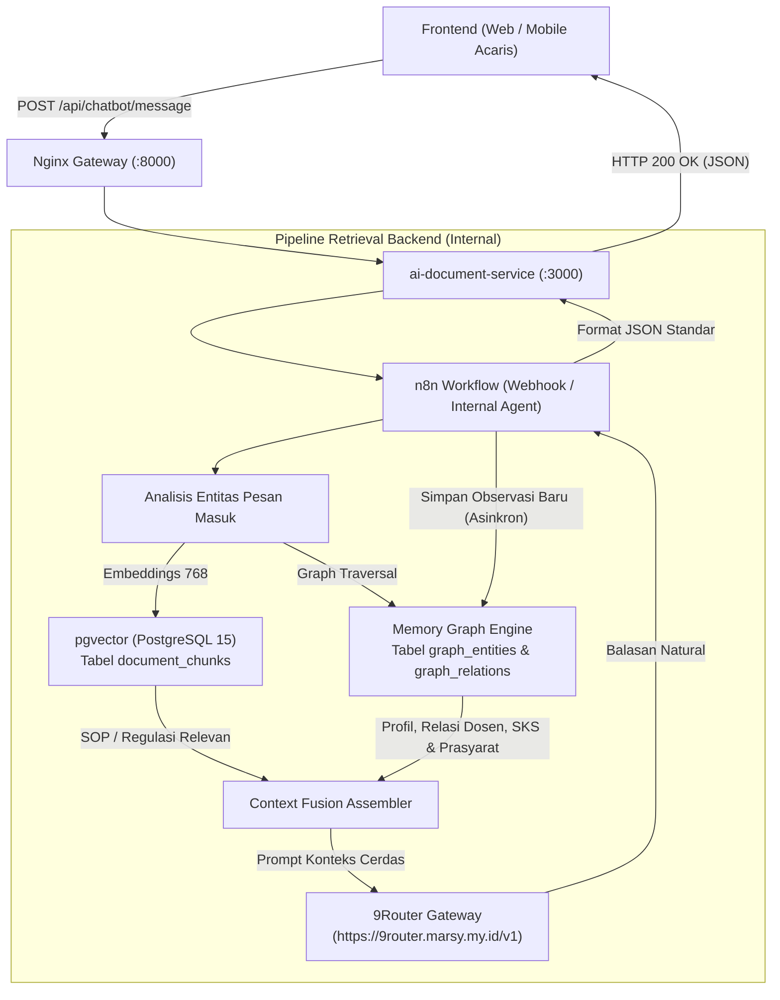

# 🧠 Rancangan Integrasi Memory Graph (Graph RAG) — Acaris Backend Self-Hosted

Dokumen ini memuat blueprint arsitektur, skema data, dan alur integrasi **Memory Graph (Hierarchical Graph RAG)** ke dalam layanan backend Acaris (`ai-document-service` & alur n8n).

---

## 🎯 1. Prinsip Utama: Zero Frontend Changes (100% Kompatibel)

Perubahan ini **hanya terjadi pada proses internal backend**. Seluruh kontrak antarmuka API ke frontend tetap beku (*frozen*) dan tidak berubah satu baris pun.

### Kontrak Endpoint Frontend yang Tetap Sama:
* `POST /api/chatbot/message`
  * **Payload Request:**
    ```json
    {
      "message": "Halo Aca, apa syarat mengambil mata kuliah Tugas Akhir?",
      "session_id": "session-uuid-12345"
    }
    ```
  * **Response:**
    ```json
    {
      "reply_text": "Untuk mengambil Tugas Akhir...",
      "balasan_aca": "Untuk mengambil Tugas Akhir...",
      "session_id": "session-uuid-12345"
    }
    ```
* `POST /api/chatbot/stream`
* `GET /api/chatbot/session/active`
* `GET /api/chatbot/history`
* `POST /api/chatbot/session/:id/close`

---

## 💡 2. Mengapa Perlu Memory Graph? (Dampak & Keunggulan)

Saat ini, chatbot Acaris mengandalkan **Pure Vector Search (`pgvector` 768)**. 

### Perbandingan Vector Murni vs Hybrid Memory Graph:

| Karakteristik | Vector Search Murni (`pgvector`) | Hybrid Search (`pgvector` + Memory Graph) |
| :--- | :--- | :--- |
| **Kelebihan** | Pencarian semantik teks SOP / dokumen regulasi kampus. | Menghubungkan konteks personal, relasi antar-entitas, dan riwayat lintas sesi. |
| **Kelemahan** | Tidak memahami relasi terstruktur (*multi-hop reasoning*), sering lupa konteks lama mahasiswa jika berada di luar batas token. | Membutuhkan ekstraksi entitas di latar belakang (dijalankan asinkron). |
| **Contoh Kasus** | User tanya: *"Apakah saya boleh ambil mata kuliah X?"* $\rightarrow$ Vector hanya mengambil silabus mata kuliah X. | Graph tahu riwayat SKS user, mata kuliah prasyarat yang sudah/belum lulus, serta siapa dosen pengampunya $\rightarrow$ Jawaban langsung terarah spesifik untuk mahasiswa tersebut. |

---

## 🏛️ 3. Arsitektur Dataflow Hybrid Retrieval



---

## 🗄️ 4. Opsi Skema Penyimpanan Graph di PostgreSQL (`acaris-db`)

Untuk menghemat resource VPS tanpa perlu menambah kontainer database graph baru (seperti Neo4j yang berat), kita dapat memanfaatkan PostgreSQL yang sudah aktif dengan skema relasional graph:

```sql
-- 1. Entitas (Mahasiswa, Dosen, Mata Kuliah, Topik Riset, Dokumen)
CREATE TABLE IF NOT EXISTS graph_entities (
    id UUID PRIMARY KEY DEFAULT gen_random_uuid(),
    name VARCHAR(255) NOT NULL,
    entity_type VARCHAR(50) NOT NULL, -- 'mahasiswa', 'dosen', 'matakuliah', 'regulasi'
    metadata JSONB DEFAULT '{}',
    created_at TIMESTAMP WITH TIME ZONE DEFAULT CURRENT_TIMESTAMP,
    updated_at TIMESTAMP WITH TIME ZONE DEFAULT CURRENT_TIMESTAMP,
    CONSTRAINT uq_entity_name_type UNIQUE (name, entity_type)
);

-- 2. Observasi / Fakta Terkait Entitas
CREATE TABLE IF NOT EXISTS graph_observations (
    id UUID PRIMARY KEY DEFAULT gen_random_uuid(),
    entity_id UUID NOT NULL REFERENCES graph_entities(id) ON DELETE CASCADE,
    content TEXT NOT NULL,
    source_session_id VARCHAR(100),
    created_at TIMESTAMP WITH TIME ZONE DEFAULT CURRENT_TIMESTAMP
);

-- 3. Relasi Antar-Entitas (Edges)
CREATE TABLE IF NOT EXISTS graph_relations (
    id UUID PRIMARY KEY DEFAULT gen_random_uuid(),
    source_id UUID NOT NULL REFERENCES graph_entities(id) ON DELETE CASCADE,
    target_id UUID NOT NULL REFERENCES graph_entities(id) ON DELETE CASCADE,
    relation_type VARCHAR(100) NOT NULL, -- 'dosen_pa_dari', 'prasyarat_dari', 'mengambil_topik'
    weight FLOAT DEFAULT 1.0,
    created_at TIMESTAMP WITH TIME ZONE DEFAULT CURRENT_TIMESTAMP,
    CONSTRAINT uq_graph_edge UNIQUE (source_id, target_id, relation_type)
);

CREATE INDEX IF NOT EXISTS idx_graph_entities_name ON graph_entities(name);
CREATE INDEX IF NOT EXISTS idx_graph_relations_source ON graph_relations(source_id);
CREATE INDEX IF NOT EXISTS idx_graph_relations_target ON graph_relations(target_id);
```

---

## 🚀 5. Tahapan Eksekusi Ketika Nanti Akan Diterapkan

1. **Migrasi Database:** Jalankan skrip SQL di atas ke kontainer `backend-selfhosted-acaris-db-1`.
2. **Modifikasi n8n Workflow / Backend Service:**
   * Sebelum LLM Node, tambahkan sub-node query PostgreSQL:
     ```sql
     SELECT content FROM graph_observations WHERE entity_id IN (
         SELECT id FROM graph_entities WHERE name ILIKE ANY($1)
     );
     ```
   * Gabungkan hasil observasi graph ke dalam system prompt:
     `Konteks Profil & Relasi: {{ $json.graph_context }}`.
3. **Ekstraksi Fakta Pasca-Percakapan (Background Worker):**
   * Setelah bot menjawab, kirim salinan percakapan ke background job yang meminta LLM 9Router mengekstrak fakta baru:
     Contoh output: `{"entity": "Mahasiswa-123", "observation": "Sedang menyusun Bab 2 skripsi dengan topik IoT"}`.
   * Simpan otomatis ke tabel `graph_observations`.
4. **Verifikasi:** Uji percakapan multi-sesi untuk memastikan bot mengingat fakta dari sesi bimbingan sebelumnya.

---

> [!NOTE]  
> **Instruksi Khusus:** Hapus file ini jika rancangan ini sudah diterapkan di backend.
